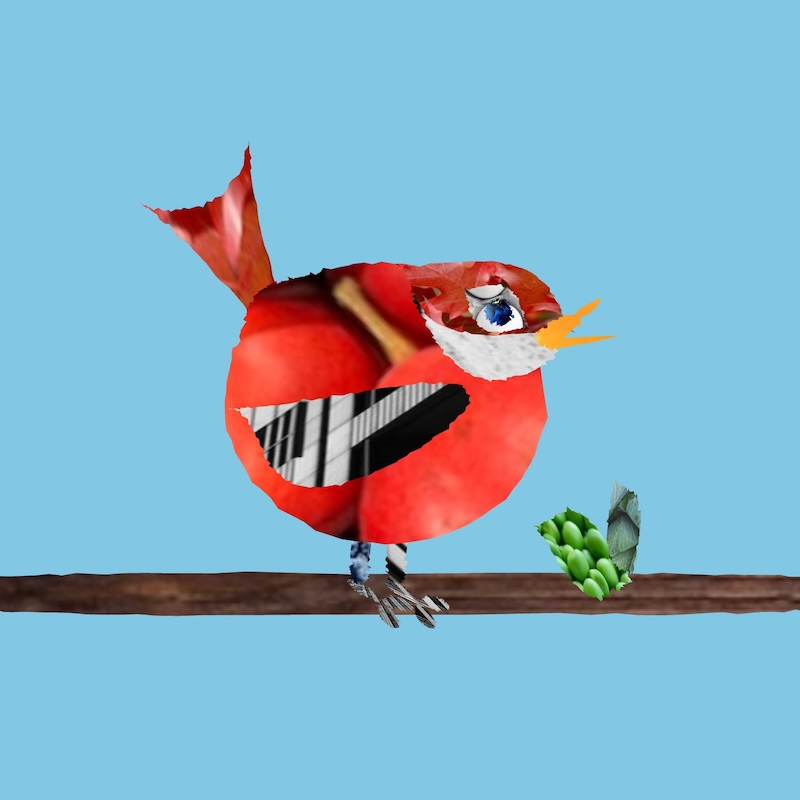
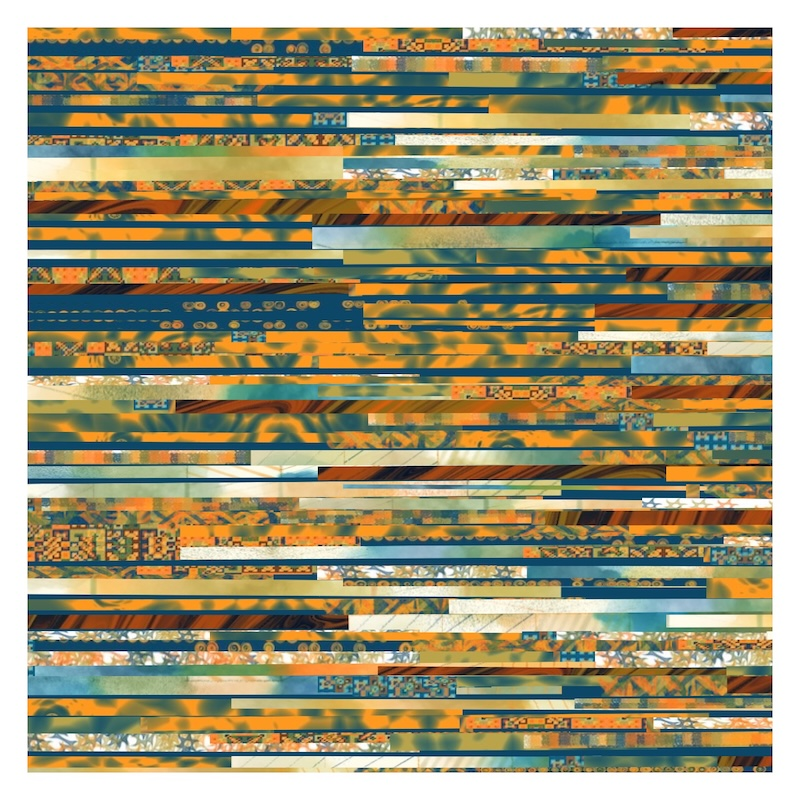

# Collage -WIP

Collage sketches created for #WCCChallenge "Child's Art" and "Collage"

## "Magazine" Collage

## Layered collage

The code for the patterns for the Layered Collage are in the Patterns folder. The inspiration was this [youtube video](https://youtu.be/ZKOESLS5oPs).

## References

--[The Happy Grid](https://editor.p5js.org/acamposuribe/sketches/oqlWTatWG)   
--[Marble](https://www.shadertoy.com/view/4td3RN)   
--[Coding Challenge 179 Wolfram-ca](https://thecodingtrain.com/challenges/179-wolfram-ca)   
--[Marching Squares](https://thecodingtrain.com/challenges/c5-marching-squares)   
